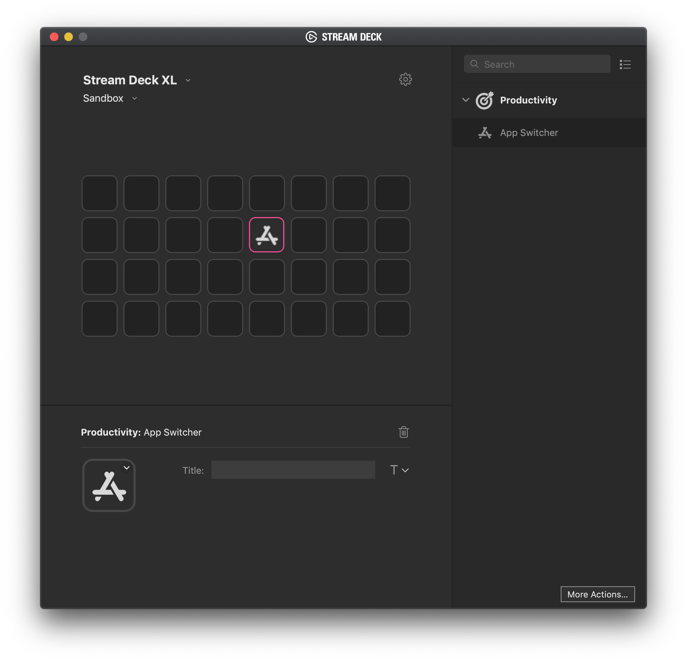

# App Switcher plugin for Stream Deck

This Stream Deck plugin let you switch between opened apps quickly. It's like pressing Command+Tab on macOS, but here you have to press only a single button.

# Description

The App Switcher plugin for [Stream Deck](https://www.elgato.com/gaming/stream-deck) let you switch between opened apps quickly. It's like pressing Command+Tab on macOS, but here you have to press exactly one button on your Stream Deck. By repeatly pressing the button it will traverse through your recent applications. This plugin is especially useful if your primary input device is something else than your keyboard.

It's made for *macOS* only.

# Features

- Switch between your recently used applications

# How to install

1. Download the latest release from the [releases](https://github.com/JarnoLeConte/streamdeck-appswitcher/releases) page.
2. Double click the `AppSwitcher.streamDeckPlugin` to install.

# Info for developers

- It's built with the following template: [streamdeck-template-swift](https://github.com/JarnoLeConte/streamdeck-template-swift)
- Code written in Swift
- Runs AppleScript
- Communicate with System Events
- macOS only
